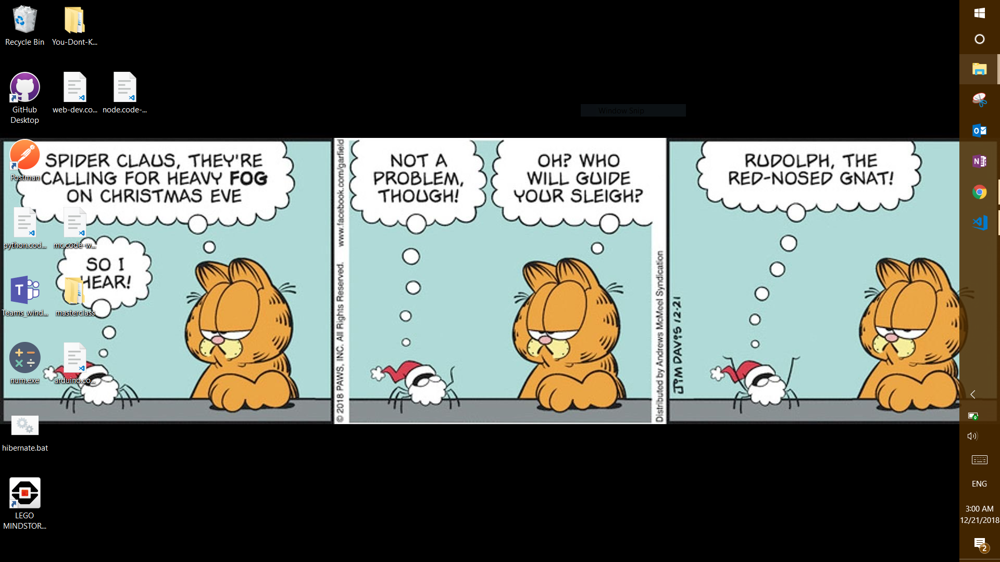

# Wallpaper updater for Windows

This is a simple project written in JavaScript that updates your wallpaper every day to a daily comic strip! Enjoy 🖼🎁👍



## Prerequisites

-  Node v8+ installed

## Run

#### To update instantly

```
npm install
npm run 
```

## Roadmap

- [x] Download images from GoComics
- [x] Set images as wallpaper
- [ ] Set to run on computer startup
- [ ] Try to download later if internet is not available on startup
